# 🚀 Employly - AI-Powered Job Matching & Web3 Networking

[](https://nextjs.org/)
[](https://www.typescriptlang.org/)
[](https://www.mongodb.com/)
[](https://polygon.technology/)

A full-stack web application that revolutionizes job matching by combining **AI-powered skill extraction** with **Web3 blockchain payment integration**. Find your perfect job match with intelligent NLP-based scoring and pay/receive securely through the Polygon network.

---

## 📋 Table of Contents

- [Features](#-features)
- [Architecture](#-architecture)
- [Tech Stack](#-tech-stack)
- [Data Flow](#-data-flow)
- [Getting Started](#-getting-started)
- [Environment Variables](#️-environment-variables)
- [Project Structure](#-project-structure)
- [API Reference](#-api-reference)
- [Web3 Payment Flow](#-web3-payment-flow)
- [AI Matching Engine](#-ai-matching-engine)
- [Database Schema](#-database-schema)
- [Deployment](#-deployment)

---

## 🎨 Brand Colors

| Color | Hex | Usage |
|-------|-----|-------|
| **Ruby Red** | `#E31C58` | Primary accent, CTAs |
| **Parrot Green** | `#00C853` | Success states, wallet connected |
| **Gold** | `#FFB800` | Highlights, premium features |

---

## ✨ Features

### 🔐 Authentication & User Management
- **JWT-based Authentication** - Secure token-based auth with bcrypt password hashing
- **User Profiles** - Complete profile management with skills, bio, and avatar
- **Role-based Access** - Support for both job seekers and recruiters

### 💼 Job Marketplace
- **Job Listings** - Create, browse, filter, and apply to jobs
- **Smart Filtering** - Filter by skills, location, job type (remote/hybrid/onsite)
- **Application Tracking** - Track your job applications and their status

### 🤖 AI-Powered Features
- **Skill Extraction** - OpenAI GPT-3.5 powered skill extraction from resumes/bios
- **Keyword Fallback** - Reliable fallback with 50+ common tech skills
- **Job Matching Scores** - NLP-based 0-100% compatibility scoring
- **Smart Recommendations** - AI-driven job suggestions based on your profile

### 🌐 Social Networking
- **Activity Feed** - Share updates, achievements, and thoughts
- **Likes & Comments** - Engage with your professional network
- **Real-time Updates** - Stay connected with the community

### 💎 Web3 Integration
- **MetaMask Wallet** - Seamless wallet connection
- **Polygon Mumbai Testnet** - Fast, low-cost blockchain transactions
- **Platform Fee** - Micro-payment of 0.00001 MATIC per job post
- **On-chain Verification** - Transparent transaction verification

---

## 🏗 Architecture

The application follows a modern **full-stack Next.js architecture** with clear separation between client, server, and blockchain layers.

```mermaid
graph TB
    subgraph Client["🖥️ Client Layer"]
        UI[Next.js 14 Frontend]
        AuthCtx[Auth Context]
        Web3Ctx[Web3 Context]
    end
    
    subgraph Server["⚙️ Server Layer"]
        API[Next.js API Routes]
        Auth[JWT Auth Middleware]
        AI[OpenAI Integration]
    end
    
    subgraph Data["💾 Data Layer"]
        MongoDB[(MongoDB Atlas)]
        Models[Mongoose Models]
    end
    
    subgraph Blockchain["⛓️ Blockchain Layer"]
        MetaMask[MetaMask Wallet]
        Polygon[Polygon Mumbai]
        Contract[Smart Contracts]
    end
    
    UI --> AuthCtx
    UI --> Web3Ctx
    AuthCtx --> API
    Web3Ctx --> MetaMask
    API --> Auth
    API --> AI
    Auth --> Models
    Models --> MongoDB
    MetaMask --> Polygon
    Polygon --> Contract
```



### Component Breakdown

| Layer | Purpose | Technologies |
|-------|---------|--------------|
| **Client** | User interface, state management | Next.js 14, React Context, Tailwind CSS |
| **Server** | API logic, authentication, AI processing | Next.js API Routes, JWT, OpenAI SDK |
| **Data** | Persistence, data modeling | MongoDB Atlas, Mongoose ODM |
| **Blockchain** | Payments, verification | Ethers.js, Polygon Mumbai, MetaMask |

---

## 🛠 Tech Stack


| Category | Technology | Version |
|----------|------------|---------|
| **Framework** | Next.js | 14.x |
| **Language** | TypeScript | 5.x |
| **Styling** | Tailwind CSS | 3.x |
| **Database** | MongoDB | 6.x |
| **ODM** | Mongoose | 8.x |
| **Authentication** | JWT + bcrypt | - |
| **AI** | OpenAI GPT-3.5 | turbo |
| **Blockchain** | Polygon Mumbai | Testnet |
| **Web3** | Ethers.js | 5.x |

---

## 🔄 Data Flow

### User Registration & Authentication Flow


### Job Posting with Web3 Payment


### AI-Powered Job Matching

```mermaid
flowchart LR
    subgraph Input
        UP[User Profile]
        JL[Job Listing]
    end
    
    subgraph AI["🤖 AI Processing"]
        SE[Skill Extraction]
        NLP[NLP Analysis]
        MS[Match Scoring]
    end
    
    subgraph Output
        Score[Match Score 0-100%]
        Matched[Matched Skills]
        Missing[Missing Skills]
        Rec[Recommendations]
    end
    
    UP --> SE
    JL --> SE
    SE --> NLP
    NLP --> MS
    MS --> Score
    MS --> Matched
    MS --> Missing
    MS --> Rec
```



---

## 📦 Getting Started

### Prerequisites

- **Node.js** >= 18.x
- **npm** >= 9.x or **yarn** >= 1.22
- **MongoDB Atlas** account (or local MongoDB)
- **MetaMask** browser extension
- **OpenAI** API key (optional, for AI features)

### Installation

```bash
# Clone the repository
git clone https://github.com/your-username/employly.git
cd employly/job-portal

# Install dependencies
npm install

# Create environment file
cp .env.example .env.local

# Configure your credentials in .env.local (see section below)

# Run development server
npm run dev
```

Open [http://localhost:3000](http://localhost:3000) to view the application.

### Development Scripts

| Command | Description |
|---------|-------------|
| `npm run dev` | Start development server with hot reload |
| `npm run build` | Build for production |
| `npm run start` | Start production server |
| `npm run lint` | Run ESLint |

---

## ⚙️ Environment Variables

Create a `.env.local` file in the root directory with the following variables:

```env
# Database (replace with your actual MongoDB connection string)
MONGODB_URI=mongodb+srv://<your-username>:<your-password>@<your-cluster>.mongodb.net/employly

# Authentication
JWT_SECRET=your-super-secret-jwt-key-min-32-characters

# AI (Optional - falls back to keyword matching)
OPENAI_API_KEY=sk-your-openai-api-key

# Web3 Configuration
NEXT_PUBLIC_ADMIN_WALLET=0xYourAdminWalletAddress
NEXT_PUBLIC_POLYGON_RPC=https://rpc-mumbai.maticvigil.com
NEXT_PUBLIC_CHAIN_ID=80001
```

### Variable Descriptions

| Variable | Required | Description |
|----------|----------|-------------|
| `MONGODB_URI` | ✅ | MongoDB connection string |
| `JWT_SECRET` | ✅ | Secret key for JWT token signing (min 32 chars) |
| `OPENAI_API_KEY` | ❌ | OpenAI API key for AI features |
| `NEXT_PUBLIC_ADMIN_WALLET` | ✅ | Wallet address to receive platform fees |
| `NEXT_PUBLIC_POLYGON_RPC` | ✅ | Polygon Mumbai RPC URL |
| `NEXT_PUBLIC_CHAIN_ID` | ✅ | Chain ID (80001 for Mumbai) |

---

## 📁 Project Structure

```
src/
├── app/                       # Next.js 14 App Router
│   ├── api/                   # API Routes
│   │   ├── auth/              # Authentication endpoints
│   │   │   ├── register/      # POST - User registration
│   │   │   ├── login/         # POST - User login
│   │   │   └── me/            # GET - Current user
│   │   ├── jobs/              # Job management endpoints
│   │   │   ├── route.ts       # GET/POST - List/Create
│   │   │   ├── [id]/          # Job by ID operations
│   │   │   ├── extract-skills/# AI skill extraction
│   │   │   └── generate-description/# AI job descriptions
│   │   ├── feed/              # Social feed endpoints
│   │   ├── profile/           # User profile endpoints
│   │   └── health/            # Health check endpoint
│   ├── auth/                  # Auth pages (login, register)
│   ├── jobs/                  # Job listing pages
│   ├── feed/                  # Social feed page
│   └── profile/               # User profile page
├── components/                # React components
│   ├── ui/                    # UI components (Navbar, etc.)
│   ├── jobs/                  # Job-related components
│   ├── ai/                    # AI feature components
│   └── web3/                  # Web3 components (WalletConnect)
├── context/                   # React Context providers
│   ├── AuthContext.tsx        # Authentication state
│   └── Web3Context.tsx        # Web3/Wallet state
├── lib/                       # Utility libraries
│   ├── ai.ts                  # OpenAI integration
│   ├── auth.ts                # JWT utilities
│   ├── mongodb.ts             # Database connection
│   ├── web3.ts                # Blockchain utilities
│   ├── rateLimit.ts           # API rate limiting
│   └── validations.ts         # Input validation
├── models/                    # Mongoose schemas
│   ├── User.ts                # User model
│   ├── Job.ts                 # Job listing model
│   ├── Post.ts                # Social post model
│   └── ScrapedJob.ts          # Scraped jobs model
├── hooks/                     # Custom React hooks
└── types/                     # TypeScript definitions
```

---

## 🔗 API Reference

### Authentication

| Method | Endpoint | Description | Auth |
|--------|----------|-------------|------|
| `POST` | `/api/auth/register` | Register new user | ❌ |
| `POST` | `/api/auth/login` | Login user | ❌ |
| `GET` | `/api/auth/me` | Get current user | ✅ |

### Jobs

| Method | Endpoint | Description | Auth |
|--------|----------|-------------|------|
| `GET` | `/api/jobs` | List all jobs | ❌ |
| `POST` | `/api/jobs` | Create job (requires payment) | ✅ |
| `GET` | `/api/jobs/[id]` | Get job details | ❌ |
| `POST` | `/api/jobs/[id]/apply` | Apply to job | ✅ |
| `POST` | `/api/jobs/extract-skills` | AI skill extraction | ✅ |
| `POST` | `/api/jobs/generate-description` | AI job description | ✅ |

### Social Feed

| Method | Endpoint | Description | Auth |
|--------|----------|-------------|------|
| `GET` | `/api/feed` | List all posts | ❌ |
| `POST` | `/api/feed` | Create new post | ✅ |
| `POST` | `/api/feed/[id]/like` | Like a post | ✅ |
| `POST` | `/api/feed/[id]/comment` | Comment on post | ✅ |

### Profile

| Method | Endpoint | Description | Auth |
|--------|----------|-------------|------|
| `GET` | `/api/profile` | Get user profile | ✅ |
| `PUT` | `/api/profile` | Update profile | ✅ |

---

## 💳 Web3 Payment Flow

### Step-by-Step Process


### Payment Details

| Property | Value |
|----------|-------|
| **Network** | Polygon Mumbai Testnet |
| **Chain ID** | 80001 |
| **Currency** | MATIC |
| **Platform Fee** | 0.00001 MATIC |
| **Recipient** | Admin Wallet (configured) |

### Getting Test MATIC

To post jobs, you'll need testnet MATIC tokens:

1. Visit the [Polygon Faucet](https://faucet.polygon.technology/)
2. Enter your wallet address
3. Select "Mumbai" network
4. Request test MATIC

---

## 🤖 AI Matching Engine

The AI matching system uses a hybrid approach combining OpenAI's GPT-3.5 with keyword-based fallback.

### Skill Extraction


### Match Score Calculation

The matching algorithm considers:

1. **Skill Overlap** - Direct matches between user skills and job requirements
2. **Semantic Similarity** - AI-powered understanding of related skills
3. **Experience Level** - Inferred from bio and skill count
4. **Missing Skills** - Gap analysis for improvement suggestions

### Score Interpretation

| Score Range | Interpretation | Color |
|-------------|----------------|-------|
| 80-100% | Excellent match | 🟢 Green |
| 60-79% | Good match | 🟡 Yellow |
| 40-59% | Moderate match | 🟠 Orange |
| 0-39% | Low match | 🔴 Red |

---

## 📊 Database Schema

### Entity Relationship Diagram


### Model Details

#### User Model
- Indexed on `skills` for fast job matching queries
- Unique constraint on `email`
- Password hashed with bcrypt before storage

#### Job Model
- Text index on `title` and `description` for search
- Indexed on `requiredSkills`, `tags`, `location`, `status`, `createdAt`
- References `User` for poster and applicants

---

## 🚀 Deployment

### Vercel (Recommended)

```bash
# Install Vercel CLI
npm i -g vercel

# Build and deploy
vercel --prod
```

### Environment Setup for Production

1. Create a new Vercel project
2. Add all environment variables in Vercel dashboard
3. Connect your MongoDB Atlas cluster (whitelist Vercel IPs)
4. Deploy!

### Build Commands

```bash
# Production build
npm run build

# Check for errors
npm run lint

# Start production server locally
npm start
```

---

## 🔒 Security Features

- **Password Hashing** - bcrypt with salt rounds
- **JWT Authentication** - Secure token-based auth
- **Input Validation** - Zod schema validation
- **Rate Limiting** - Prevent API abuse
- **XSS Protection** - Input sanitization
- **CORS** - Configured for allowed origins

---

## 🤝 Contributing

1. Fork the repository
2. Create a feature branch (`git checkout -b feature/amazing-feature`)
3. Commit your changes (`git commit -m 'Add amazing feature'`)
4. Push to the branch (`git push origin feature/amazing-feature`)
5. Open a Pull Request

---

## 📄 License

This project is licensed under the MIT License - see the [LICENSE](LICENSE) file for details.

---

<div align="center">

**Built with ❤️ by the Employly Team**

[Website](https://employly.com) · [Documentation](https://docs.employly.com) · [Report Bug](https://github.com/employly/issues)

</div>
